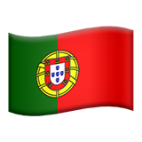
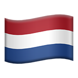
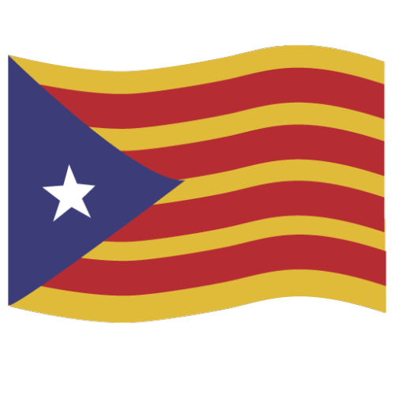

Short CV
======
**BSc** Computer Science, *Universidade do Minho*   & *Universiteit van Amsterdam*  

**MSc** Bioinformatics, *Università Di Bologna*  

**PhD** Albert Compte lab, *Universidad de Barcelona*  

**postdoc** (soon) Srdjan Ostojic lab, *Ecole Normale Superieure*  

Meaningless bio
======

I started studying Civil Engineering but quickly realized I didn't want to spent my life building bridges, so switched to Computer Science. I had a lot of fun during the first years (Calculus, Algebra and all the sciency part of computers) but not so much towards the end - you know, software enginering and the sort of things that pay well. Switched again, now to Bioinformatics. Then, my favourite courses were Neurobiology and Machine Learning which might have influenced the choice of my PhD topic.

Before enrolling in a PhD program in Barcelona, I traveled within Central America for a year, where I developed a passion for street photography. Check some of my pictures at the Street Photography corner. During my 6-year long PhD in Albert Compte’s lab I spent most of my time in rooftop barbecues organised by Genis. In my free time, I focused on the possible neural mechanisms of working memory. 

Because I am now a postdoc, I don't have much free time anymore, so I hope I can finally focus full time on Genis' barbecues.
