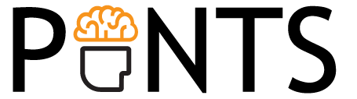
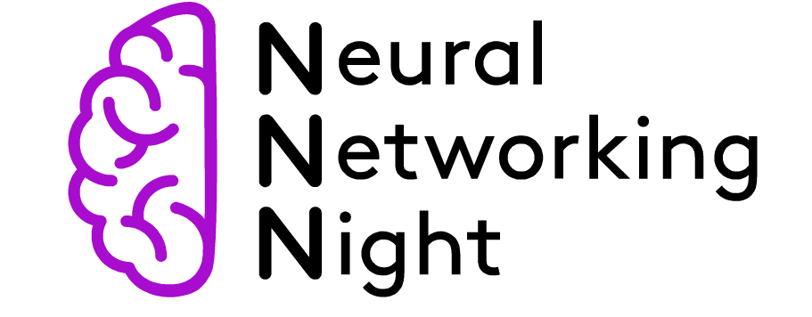

I strongly belive that a tight community is important for the well being of scientists. Since my PhD, I have been inolved in community building activities. Here's a list of the current initiatives that I am co-organizing.

## 1. Paris Ile-de-France Neuroscience, Theory, and Systems
  

A one-day conference for the Paris area, with an international keynote speaker, contributed talks, and posters. After a pilot event in 2022 and a successful revamped edition in 2024, we hope to make this a staple local conference that can highlight the excellent research performed across Île-de-France. 

[PINTS homepage](pints.fr) 

Organizers: Joao Barbosa, Sophie Bagur, Yves Boubenec, N Alex Cayco Gajic

## 2. Neural Networking Night

A monthly seminar series designed to bring together the Parisian neuroscience community. One Friday a month, we host a scientific talk and an apéro in an iconic student bar in the 5th arrondissement of Paris. Doors at 17.00, talk at 17.15, happy hour at 18.00. Like Pint of Science, but for researchers.

[NNN homepage](https://neuralnetworkingnight.github.io/)

Organizers: Michael Graupner, Joao Barbosa, Srdjan Ostojic, N Alex Cayco Gajic 

## 3. Neurochats (founder, not an organizer anymore)

The goal of the Neurochats seminar aims to bring together young researchers from Barcelona and to encourage interaction among the various research centers in the city and its surroundings. The event counts with the pleasure of free pizza and the excitement of scientific discovery, creating a relaxed and engaging atmosphere for knowledge exchange. The format includes informal talks lasting 45 minutes followed by a 15-minute discussion, allowing masters, PhD students, and postdoctoral fellows to familiarize themselves with their colleagues’ research.

[Neurochats homepage](https://www.crm.cat/neurochats-seminar/)

Organizers: Caterina Barezzi, Tomas Berjaga I Buisan, Alexandre Garcia-Duran Castilla
